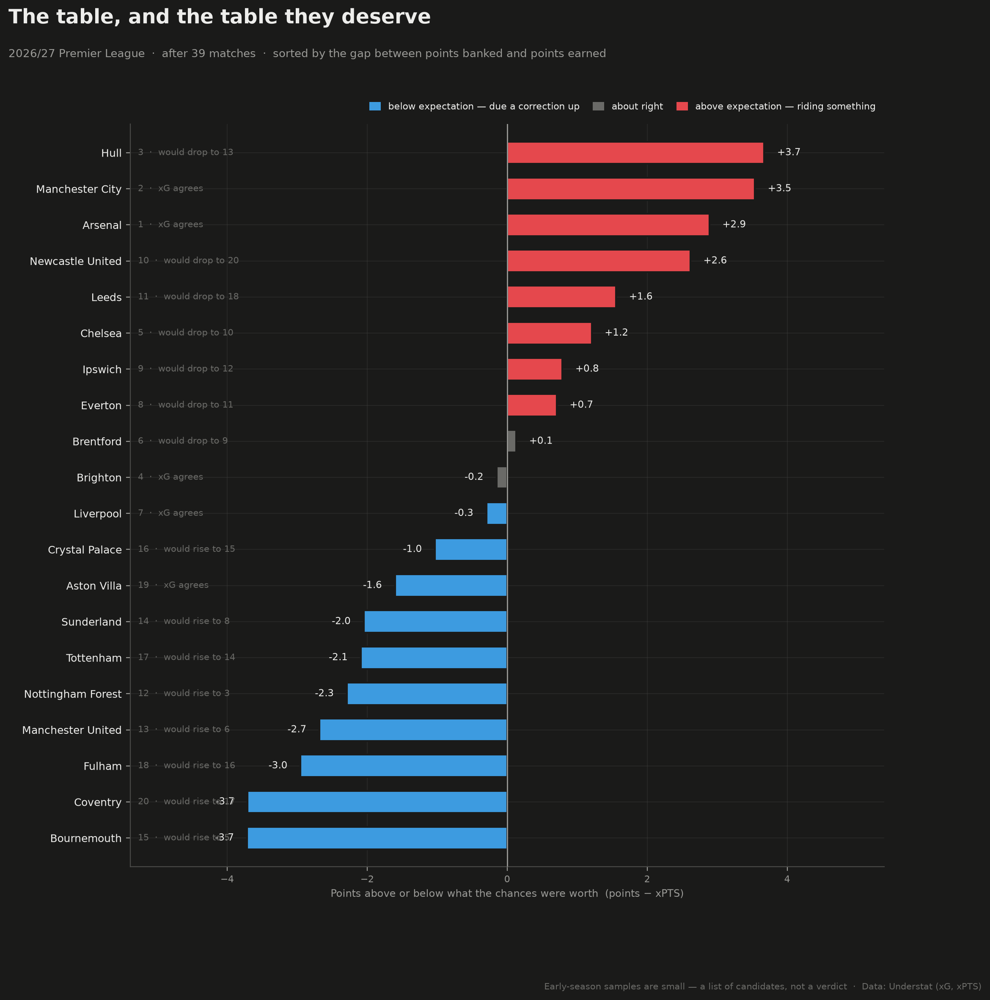

# Premier League analytics

Five figures over one shared data layer, built on free football data. Currently
tracking the **2026/27 Premier League**.

| | |
|---|---|
| **`luck`** | The table beside the table the play deserved |
| **`recruit`** | npxG vs xA per 90 — who creates, who finishes |
| **`value`** | FPL price against expected production |
| **`press`** | PPDA against xG conceded — how a side defends |
| **`shots`** | Shot map for a single match, sized by xG |



## Quick start

Needs [uv](https://docs.astral.sh/uv/). **uv 0.12 or newer** — older versions
write their editable-install `.pth` files with the macOS hidden flag, which
CPython 3.13 then ignores, and `import football` fails with a bare
`ModuleNotFoundError`. `pyproject.toml` refuses to run on an older uv rather
than let you hit that.

```bash
git clone https://github.com/tobibytes/pl-analytics.git && cd pl-analytics
uv self update          # if you are below 0.12
uv sync                 # creates .venv, installs the pinned lockfile

uv run football luck
uv run football table
```

No API key is needed for any chart. Four of the five sources are keyless.

### If `import football` fails

```
ModuleNotFoundError: No module named 'football'
```

You built the environment with uv older than 0.12 at some point. Clear the
build cache as well as the environment — rebuilding alone is not enough:

```bash
uv cache clean football
rm -rf .venv
uv sync
```

The cause, in full, because half of it is not guessable:

1. uv below 0.12 wrote its editable-install `.pth` with the macOS `UF_HIDDEN`
   flag, and CPython 3.13's `site.addpackage()` **skips hidden `.pth` files**.
   The package is installed, correctly, and simply never reaches `sys.path`.
2. That artifact was cached. `uv sync` restores it from the cache as a
   **hardlink**, flag and all — so `rm -rf .venv && uv sync` fixes it until the
   next cache restore brings the same inode back. Hence `uv cache clean`.

Confirm it is healthy with:

```bash
ls -lO .venv/lib/python3.13/site-packages/
```

The flags column reads `hidden` when broken and `-` when correct.

## The commands

```bash
uv run football luck                              # points banked vs points earned
uv run football luck --top 8                      # only the biggest gaps

uv run football recruit                            # midfielders and forwards
uv run football recruit --position FWD --max-age 23
uv run football recruit --max-price 6.5 --labels 8
uv run football recruit --highlight "Bryan Mbeumo" "Morgan Rogers"

uv run football value                              # price vs production, by position
uv run football value --max-price 8.0
uv run football value --include-unavailable

uv run football press                              # defensive style
uv run football press --highlight Arsenal Brighton

uv run football shots --match latest               # most recent match
uv run football shots --match 31209                # a specific Understat match
uv run football shots --match 3869685 --source statsbomb   # 2022 World Cup final

uv run football table                              # the luck table as text
uv run football fixtures --next 10                 # needs a football-data.org key
```

Shared flags: `-o/--output` to choose the file, `--csv` to also dump the rows
behind the chart, `--show` to open a window instead of saving, `--season 2025`
to look at a previous season.

`uv run football clear-cache` drops cached responses when you want fresh data.

## Optional: an API key

Only `fixtures` needs one — it is the one thing Understat cannot give you
(confirmed kick-off times and the appointed referee).

```bash
cp .env.example .env
# add FOOTBALL_DATA_TOKEN from https://www.football-data.org/client/register
```

`.env` is gitignored. Free tier, 10 requests a minute.

## Where the data comes from

| Source | Key | What it gives |
|---|---|---|
| [Understat](https://understat.com) | no | xG, xA, shot locations, PPDA, xPTS |
| [Fantasy Premier League](https://fantasy.premierleague.com) | no | price, ownership, availability, age, minutes |
| [football-data.org](https://www.football-data.org) | free tier | fixtures, referees, crests, canonical ids |
| [StatsBomb open data](https://github.com/statsbomb/open-data) | no | full event data — archive seasons only |

`docs/data-sources.md` has the full research: every endpoint, real payloads,
and what each source does *not* have. Worth reading before adding a source.

Understat has no public API. The routes used here were read out of the site's
own JavaScript, and they may change — they are pinned in one module so a break
is a one-file fix, and responses are cached so a break does not take yesterday's
charts with it.

**StatsBomb's licence requires attribution.** Every figure carries it. Keep it.

## Using it as a library

The CLI is a thin wrapper. The interesting part is `Season`, which joins all
four sources into tidy frames, so the projects can read each other's numbers:

```python
from football.season import Season

season = Season()                      # defaults to the current season
season.table()                         # standings + xPTS + PPDA, one row per club
season.form()                          # cumulative points vs xPTS, match by match
season.player_pool(min_minutes=270,    # Understat xG joined to FPL price/age
                   position="FWD",
                   max_age=23)
season.fixtures                        # all 380, with xG and win forecasts
season.join_report.summary()           # how well the player name join went
```

Cross-project questions are the point of sharing a layer. "Fulham are bottom of
the luck table — are their attackers cheap and under-owned?" is one query:

```python
from football.season import Season

season = Season()
unlucky = season.table().nsmallest(3, "luck")["team_key"]
pool = season.player_pool(min_minutes=180, position=["MID", "FWD"])
pool[pool["team_key"].isin(unlucky)].nlargest(5, "npxgi_per_90")[
    ["player", "team", "price", "selected_by_percent", "npxgi_per_90"]
]
```

Each project is `figure(season, **options) -> (fig, frame)`, so you can call
one directly and keep the DataFrame:

```python
from football.projects import recruitment
fig, shortlist = recruitment.figure(season, position="FWD", max_age=23)
shortlist.to_csv("shortlist.csv")
```

## Adding your own project

1. Add `src/football/projects/<name>.py` with a `figure(season, ...)` that
   returns `(fig, frame)`.
2. Read from `Season` — never fetch directly, or you lose the cache and the
   name reconciliation.
3. Use `football.theme` for colours and `theme.place_labels` for any scatter.
4. Wire a subcommand into `src/football/cli.py`.

`CLAUDE.md` documents the conventions — the palette and why it is what it is,
the pitch coordinate system, and the data gotchas worth knowing before you
trust a join.

## Layout

```
src/football/
  sources/      one module per upstream feed, returning tidy DataFrames
  projects/     one module per figure
  season.py     the join: everything above, reconciled
  teams.py      club-name reconciliation across sources
  matching.py   player-name matching between Understat and FPL
  theme.py      shared palette, type and label placement
  cache.py      disk cache, so re-runs are free and offline
  cli.py        the command line
tests/          pure-logic tests, no network
docs/           data-source research
output/         generated figures
```

## Tests

```bash
uv run --group dev pytest
uv run --group dev ruff check
```

## Licence

MIT — see `LICENSE`.

Data is not covered by that licence and belongs to its providers. StatsBomb's
open-data terms **require attribution**; every figure carries it and you should
keep it on anything you publish. Understat and the FPL API are used here for
personal, non-commercial analysis.
